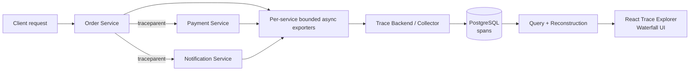

<div align="center">

# MicroTrace

**Distributed tracing and observability, built from first principles.**

Follow one request across multiple services — from W3C Trace Context propagation, to asynchronous span export, to PostgreSQL persistence, to a custom waterfall dashboard.

**Python · FastAPI · React · TypeScript · PostgreSQL · Docker · GitHub Actions · AWS EC2**

</div>

**Status:** Feature-complete for the approved portfolio scope. Deployment and Gate E
were verified on AWS EC2; the instance is currently stopped. The screenshots below
show the actual deployed application. Run locally to explore it.

**Contents:** [Screenshots](#screenshots) · [Capabilities](#what-microtrace-does) · [Request flow](#one-request-end-to-end) · [Architecture](#system-architecture) · [Engineering decisions](#engineering-decisions) · [Run locally](#run-locally) · [Testing](#testing-and-quality-gates) · [Deployment](#deployment) · [Limitations](#known-limitations)

---

## Screenshots

> These are captures from the real running MicroTrace application, not mockups.

<p align="center">
  
</p>

<p align="center">
  <sub><b>Trace Explorer</b> — inspect recent distributed traces, filter by service/status/duration, and open any trace for reconstruction details.</sub>
</p>

<br>

<p align="center">
  
  
</p>

<p align="center">
  <sub><b>Slow trace</b> — latency is visible through span geometry.</sub>
  &nbsp;&nbsp;&nbsp;
  <sub><b>Error trace</b> — failed spans use explicit error labels and striped bars.</sub>
</p>

---

<details>
<summary>Healthy trace: all eight spans across three services</summary>


</details>

## The problem

A single user request in a distributed system may cross several services.

When that request becomes slow or fails, knowing that “something went wrong” is not enough. You need to know:

- which services handled the request,
- how those operations were related,
- where the latency was introduced,
- which operation failed,
- and whether telemetry arrived late or out of order.

**MicroTrace reconstructs the request path from the spans it receives and makes it visible as a trace waterfall.**

It is intentionally small enough to understand end to end, but complete enough to demonstrate the core mechanics behind distributed tracing systems.

---

## What MicroTrace does

| Capability | What it does |
|---|---|
| W3C trace propagation | Implements a W3C Trace Context-aware version-00 subset across HTTP boundaries |
| Span creation | Creates `SERVER`, `CLIENT`, and `INTERNAL` spans |
| Async context | Uses `ContextVar` state so concurrent requests keep independent active spans |
| Best-effort export | Moves finished spans through a bounded asynchronous exporter |
| Persistent ingestion | Stores spans idempotently in PostgreSQL |
| Out-of-order support | Accepts child spans before their parents |
| Reconstruction | Rebuilds parent/child trace trees from IDs rather than arrival order |
| Trace summaries | Derives trace duration, status, services, span count, and completeness from spans |
| Waterfall UI | Renders relative timing, hierarchy, errors, orphans, and span details |
| Controlled scenarios | Demonstrates healthy, slow-payment, and payment-error traces |
| Deployment | Verified as a six-container Docker Compose stack on AWS EC2 behind Nginx |

---

## One request, end to end

A normal MicroTrace request produces eight spans:

```text
Order SERVER
├── validate-order INTERNAL
├── Order → Payment CLIENT
│   └── Payment SERVER
│       └── process-payment INTERNAL
└── Order → Notification CLIENT
    └── Notification SERVER
        └── send-notification INTERNAL
```

The important cross-service relationship is:

```text
Payment SERVER.parent_span_id
=
Order → Payment CLIENT.span_id
```

and similarly:

```text
Notification SERVER.parent_span_id
=
Order → Notification CLIENT.span_id
```

This means the downstream server operation is a child of the outbound client operation that caused it — the same causal structure a real distributed tracing system must preserve.

---

## System architecture



The exporters run inside each business service; collection, queries and reconstruction share the trace-backend container.

### Runtime topology

```text
frontend / Nginx
order-service
payment-service
notification-service
trace-backend
postgres
```

Nginx and the compiled React app share the frontend container. Only that container publishes a production port. PostgreSQL, Payment, Notification, and collector ingestion remain internal to the Docker network.

---

## Engineering decisions

MicroTrace deliberately avoids hiding the interesting parts behind a full tracing SDK.

| Decision | Why |
|---|---|
| Custom tracing module | Makes trace/span lifecycle, context propagation, and parent relationships explicit and inspectable |
| W3C Trace Context-aware version-00 subset | Uses a standard context format without claiming full OpenTelemetry compatibility |
| `ContextVar` active span state | Keeps asynchronous/concurrent requests isolated |
| `CLIENT → SERVER` parenting | Preserves cross-service causality correctly |
| Immutable finished spans | Prevents telemetry changing after span completion |
| Bounded exporter queue | Prevents unbounded memory growth under collector failure |
| Zero automatic retries | Keeps failure semantics simple and avoids hidden retry infrastructure |
| Best-effort telemetry | Observability must not directly break successful business traffic |
| PostgreSQL `spans` table only | Keeps persistence simple and allows traces to be derived from actual span data |
| No parent foreign key | A child may arrive before its parent |
| Query-time reconstruction | Makes trace topology independent of ingestion order |
| Deterministic demo scenarios | Makes healthy/slow/error behavior reproducible in tests and demos |

---

## Trace model

Each finished span contains the core information needed to reconstruct distributed work:

```text
trace_id
span_id
parent_span_id
service_name
operation_name
span_kind
start_time
end_time
duration_us
status
error_type
error_message
attributes
```

### IDs

```text
trace_id = 32 lowercase hexadecimal characters, non-zero
span_id  = 16 lowercase hexadecimal characters, non-zero
```

### Span kinds

```text
SERVER
CLIENT
INTERNAL
```

### Status

```text
OK
ERROR
```

Duration uses a monotonic clock, while timestamps use UTC wall-clock time. ContextVar tokens restore the previous active span after normal completion, exceptions and task cancellation.

---

## W3C Trace Context

MicroTrace implements a strict **W3C Trace Context-aware version-00 subset**.

It parses and formats `traceparent` and preserves valid incoming trace flags without implementing sampling decisions.

Malformed, unsupported, or missing context does not break the request — MicroTrace starts a new root trace instead.

MicroTrace does **not** claim full OpenTelemetry or OTLP compatibility.

---

## Export and ingestion

Each service hands finished spans to its own bounded exporter. The defaults are:

```text
capacity: 256
workers: 1
delivery timeout: 1 second
automatic retries: 0
overflow policy: drop newest span
shutdown drain: 2 seconds
```

Business requests enqueue finished snapshots without awaiting collector delivery. Services reuse long-lived HTTPX clients; health endpoints are excluded from tracing.

If the collector is unavailable:

```text
business request -> continues
telemetry        -> may be dropped
```

That trade-off is intentional: MicroTrace is an observability system, not part of the business transaction path.

### Collector semantics

```text
POST /api/v1/spans
```

- `201` — span stored
- `200` — duplicate span
- `422` — invalid telemetry

Attributes are bounded, allowlisted scalar values; completed snapshots are immutable and errors are sanitized. The collector accepts one span per request with a 64 KiB body limit.

The persisted identity is `(trace_id, span_id)`.

Concurrent duplicate submissions preserve the first stored payload.

---

## Reconstruction

Spans may arrive in any order.

MicroTrace reconstructs traces by indexing spans by `span_id`, locating roots, attaching children whose `parent_span_id` exists, preserving orphans, ordering siblings deterministically, protecting traversal from cycles, and deriving depth/start offsets.

The reconstruction algorithm never relies on “the parent probably arrived first.”

Structural incompleteness and business failure are treated separately:

```text
incomplete != ERROR
```

A trace can be structurally incomplete while every stored span is `OK`. With one root, summary duration uses its monotonic duration; missing or multiple roots use the available timestamp window. Any stored `ERROR` span makes the summary `ERROR`.

---

## Demo scenarios

| Scenario | Result |
|---|---|
| `normal` | 8 spans, all `OK`, Order → Payment → Notification |
| `slow_payment` | 8 spans; delay occurs inside `process-payment` and expands its enclosing spans |
| `payment_error` | HTTP 502, 5 spans, 4 required `ERROR` spans, Notification is not called |

### Slow request

The artificial delay is placed inside `Payment INTERNAL: process-payment`, so the timing naturally expands through Payment SERVER, Order → Payment CLIENT, and the Order root span.

There is no anomaly detector and no fake “slow” field. The waterfall geometry is the evidence.

---

## Dashboard

MicroTrace has exactly two product screens:

```text
/traces
/traces/:traceId
```

### Trace Explorer

- filter by service
- filter by status
- filter by minimum duration
- offset pagination
- manual refresh
- derived trace summary
- incomplete-trace indicator

### Trace Detail

- deterministic parent-first tree
- timing ruler
- span waterfall
- SERVER / CLIENT / INTERNAL visual distinction
- explicit error labels and striped error bars
- orphan/missing-parent visibility
- span details panel
- parent navigation
- raw IDs and timing metadata

The waterfall uses backend timing data directly; it does not invent or normalize durations into arbitrary categories.

---

## Technology stack

| Layer | Technology |
|---|---|
| Backend | Python, FastAPI |
| HTTP client | HTTPX |
| Validation | Pydantic |
| Persistence | PostgreSQL |
| ORM / migrations | SQLAlchemy, Alembic |
| Frontend | React, TypeScript, Vite |
| Testing | pytest, Vitest, React Testing Library |
| Code quality | Ruff, ESLint, TypeScript |
| Containers | Docker, Docker Compose |
| Reverse proxy | Nginx |
| CI | GitHub Actions |
| Deployment | AWS EC2, Ubuntu 24.04 |

---

## Repository structure

```text
MicroTrace/
├── backend/
│   ├── microtrace_sdk/          # tracing primitives, context and exporter
│   ├── services/
│   │   ├── order/
│   │   ├── payment/
│   │   ├── notification/
│   │   └── trace_backend/
│   ├── migrations/
│   └── tests/
│
├── frontend/                    # React trace explorer and waterfall
├── scripts/                     # demo, health, Gate C, scenario and QA checks
├── docs/                        # architecture, deployment and verification docs
├── .github/workflows/ci.yml     # backend, frontend and Compose E2E CI
├── docker-compose.yml           # local stack
├── compose.production.yml       # production single-host stack
└── README.md
```

---

## API surface

### Public/read routes used by the dashboard

```text
GET /health
GET /api/v1/traces
GET /api/v1/traces/{trace_id}
GET /api/v1/services
```

### Demo entry point

```text
POST /orders
```

### Internal collector route

```text
POST /api/v1/spans
```

In production, collector ingestion is not exposed through the public Nginx route.

---

## Run locally

Requires Git, Docker with Linux containers and Compose v2 or newer. Demo commands
also require Python 3; they use only the standard library.

### Configure the environment

Copy [`.env.example`](.env.example) to `.env`. Set a local database password and
the matching URL-encoded password in `DATABASE_URL`. Keep `.env` private.

### Start the full stack

The production configuration runs compiled frontend assets behind Nginx, bound
to loopback port 8080 by default:

```sh
docker compose -f compose.production.yml up --build -d --wait --wait-timeout 180
docker compose -f compose.production.yml exec -T trace-backend alembic upgrade head
```

Open [http://localhost:8080/traces](http://localhost:8080/traces).

### Generate demo traces

```sh
python scripts/demo.py healthy --order-url http://localhost:8080 --dashboard-url http://localhost:8080
python scripts/demo.py slow --order-url http://localhost:8080 --dashboard-url http://localhost:8080
python scripts/demo.py error --order-url http://localhost:8080 --dashboard-url http://localhost:8080
```

Each command prints the trace URL. The expected error scenario exits successfully.
Optional `--slow-ms` accepts 100–3000 ms.

### Stop the stack

```sh
docker compose -f compose.production.yml down
```

For development, stop production before switching to `docker compose up --build
-d --wait`. The development stack uses Node/Vite on port 5173, the query backend
on 8000 and Order on 8001, all bound to loopback. The demo script defaults match
those development ports.

Both configurations use the same PostgreSQL named volume. Do not use `down -v`
on data you want to keep.

---

## Testing and quality gates

MicroTrace was built milestone-by-milestone with explicit acceptance gates.

| Check | Verified result |
|---|---:|
| Backend full suite | **194 passed** |
| PostgreSQL integration subset | **75 passed, 0 skipped** |
| Frontend suite | **46 passed** |
| Backend lint / format | **PASS** |
| Frontend lint / typecheck / build | **PASS** |
| Hosted GitHub Actions | **PASS** |
| Docker Compose E2E | **PASS** |

> The 75 integration tests are part of the 194 backend tests, not an additional 75.

### Run the checks

With the local production stack running and migrated:

```sh
docker compose -f compose.production.yml exec -T trace-backend sh -c 'MICROTRACE_TEST_DATABASE_URL="$DATABASE_URL" pytest'
docker compose -f compose.production.yml exec -T trace-backend sh -c 'MICROTRACE_TEST_DATABASE_URL="$DATABASE_URL" pytest -m integration'
docker compose -f compose.production.yml exec -T trace-backend python - < scripts/check_gate_c.py
```

Database tests use temporary isolated schemas. Missing test database configuration
causes explicit skips, which do not establish acceptance. For PowerShell stdin:

```powershell
Get-Content -Raw scripts/check_gate_c.py | docker compose -f compose.production.yml exec -T trace-backend python -
```

For host-side checks, create a Python 3.12 virtual environment and install the
locked development dependencies:

```sh
python -m pip install --require-hashes -r backend/requirements.lock
python scripts/check_production.py --check-restart
python scripts/check_repository.py
ruff check backend scripts
ruff format --check backend scripts
```

The production check exercises scenarios and deliberately restarts PostgreSQL;
use it on the local demo stack. From `frontend/` with Node.js 22.12 or newer:

```sh
npm ci
npm test
npm run lint
npm run typecheck
npm run build
```

Hosted [GitHub Actions](https://github.com/manthan3502/MicroTrace/actions/workflows/ci.yml)
runs Backend, Frontend and Compose E2E, including production boundaries and restart
persistence. [Final M8 run](https://github.com/manthan3502/MicroTrace/actions/runs/37158704356)
passed all three jobs on the final milestone commit.

### Engineering gates

| Gate | What it proves |
|---|---|
| **Gate A** | tracing IDs, span lifecycle, ContextVar isolation, cancellation and context restoration |
| **Gate B** | real HTTP propagation and correct CLIENT → SERVER parent relationships |
| **Gate C** | service → exporter → collector → PostgreSQL → query/reconstruction pipeline |
| **Gate D** | healthy, slow and error telemetry displayed correctly in the real dashboard |
| **Gate E** | real Linux EC2 deployment, private/public route boundaries, persistence and final CI |

Additional adversarial verification covers concurrent requests, concurrent duplicate ingestion, collector outage, PostgreSQL outage, queue overflow, child-before-parent ingestion, orphans, cycles, deep traces, randomized arrival order, restart persistence, and privacy canaries.

---

## Deployment

MicroTrace was deployed and verified on a single AWS EC2 host using Ubuntu 24.04, Docker Compose, Nginx, and a PostgreSQL named volume.

Production exposure is intentionally narrow:

```text
Internet
   │
   ▼
Nginx :80
   │
   ├── dashboard / read APIs
   └── Order demo endpoint

Docker-private network
   ├── Payment
   ├── Notification
   ├── collector ingestion
   └── PostgreSQL
```

The verified EC2 instance is currently stopped to avoid unnecessary cloud cost.
No permanent live-demo URL is advertised; the screenshots retain the deployed
healthy, slow and error scenarios.

See [deployment instructions](docs/deployment.md), [architecture and interview notes](docs/architecture.md), [limitations](docs/limitations.md), and [M8 verification](docs/m8-verification.md) for deployment and design details.

---

## Security and privacy boundaries

MicroTrace is not an authentication product, but the tracing pipeline deliberately avoids capturing sensitive request data.

The approved telemetry path excludes Authorization headers, Cookie headers, request bodies, database passwords, private keys, and tokens.

Repository and CI checks also scan for common credential patterns, personal email leakage, tracked `.env` files, and private-key material.

Production deployment keeps PostgreSQL and internal services off public host ports.

---

## What MicroTrace is — and is not

MicroTrace is a **portfolio-scale distributed tracing platform built to understand tracing mechanics end to end**.

It demonstrates trace context propagation, causal span parenting, async context isolation, bounded telemetry export, idempotent ingestion, out-of-order reconstruction, trace visualization, failure handling, containerized deployment, CI, and cloud verification.

It is **not** a replacement for Datadog, Jaeger or Tempo; a full OpenTelemetry / OTLP implementation; a production-scale multi-tenant observability platform; a durable telemetry pipeline; or an authenticated public SaaS.

### Known limitations

- telemetry export is intentionally best-effort,
- queued telemetry can be lost during failure,
- no durable queue or automatic retries,
- single-host deployment,
- no application authentication,
- HTTP-only demo deployment unless TLS is configured separately,
- PostgreSQL named volumes survive container restarts but are not managed backups,
- structural `incomplete` detection cannot identify every possible dropped span,
- no `tracestate`, sampling decisions, OTLP/gRPC or full OpenTelemetry interoperability,
- no retention, replication, multitenancy or production-scale guarantee,
- clocks can differ across hosts; the waterfall can extend beyond root duration and uses a 3px minimum width for very short bars.

These are explicit scope choices rather than hidden claims.

---

## Project status

```text
M0–M8       PASS
Gate A      PASS
Gate B      PASS
Gate C      PASS
Gate D      PASS
Gate E      PASS
Hosted CI   PASS
Deployment  Verified on AWS EC2
```

MicroTrace is feature-complete for its approved portfolio scope.
