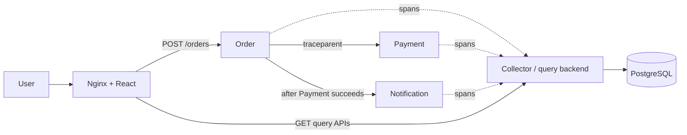
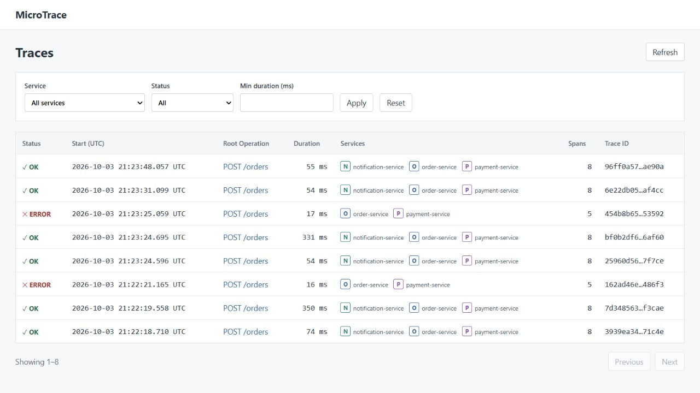
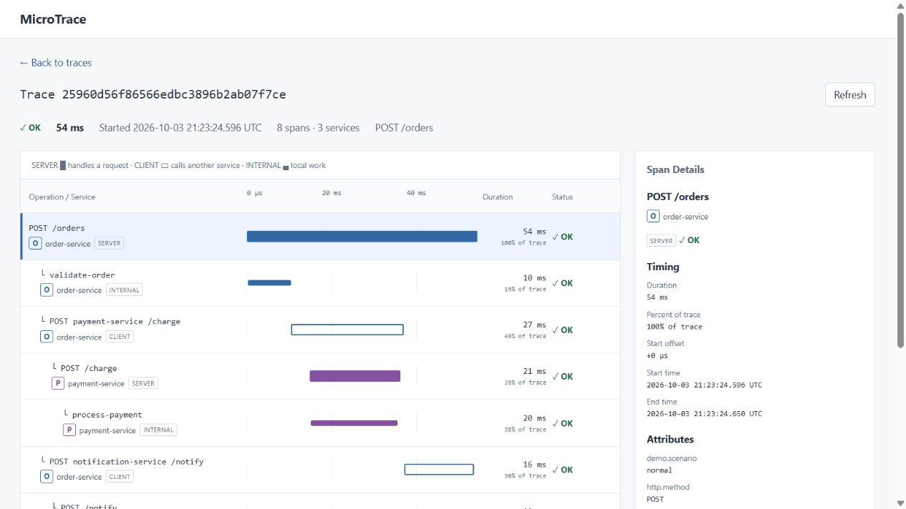
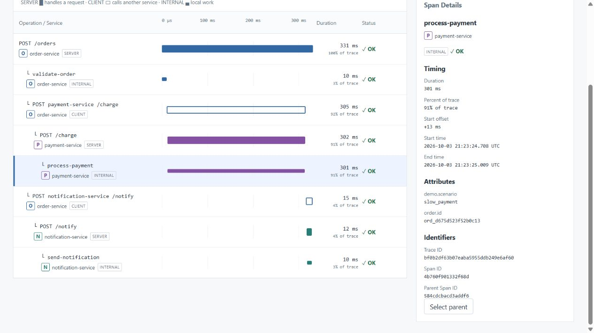
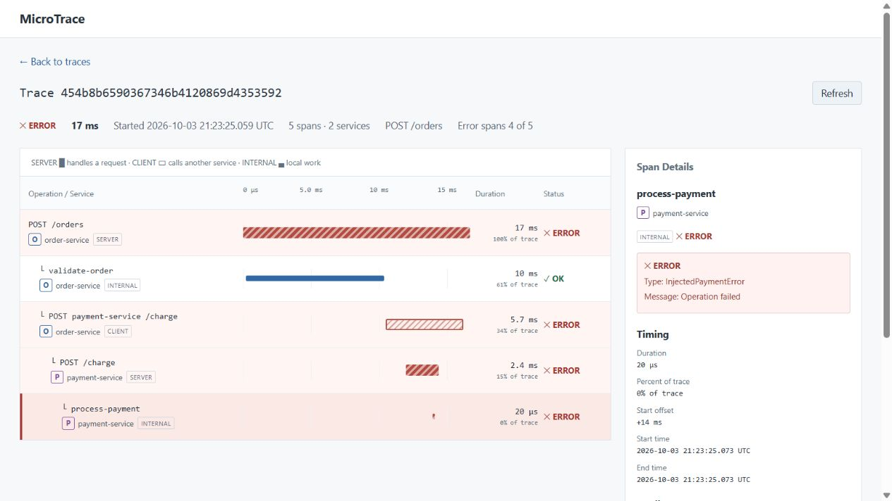

# MicroTrace

A compact distributed tracing platform built from first principles to understand
request context, span lifecycles, telemetry delivery and trace reconstruction.
Python/FastAPI, HTTPX, ContextVar, PostgreSQL, SQLAlchemy/Alembic, React/TypeScript,
Docker Compose and GitHub Actions.

IDs, propagation, span lifecycle, bounded export, reconstruction and the HTML/CSS
waterfall are custom implementations. Frameworks handle HTTP/storage/UI.
**W3C Trace Context-aware, version-00 subset**; not full OpenTelemetry/OTLP or a
production-scale observability platform.

**Live demo:** [Trace explorer](http://3.25.122.39/traces), served by Nginx on the
approved Linux EC2 host. Screenshots show real telemetry stored on that host.
Deployment/browser checks passed; final Gate E sign-off awaits hosted M8 CI.



Six containers; Nginx shares the frontend container. Only the edge publishes a
production port. Ingestion and direct backend/database access stay private.

## Trace behavior

Order SERVER creates validate-order INTERNAL and Payment/Notification CLIENT
spans. Downstream SERVER is a child of the caller's CLIENT:
`Payment SERVER.parent_span_id = Order Payment CLIENT.span_id`. Local work is
INTERNAL. ContextVar tokens isolate overlapping requests and restore prior context
on exceptions/cancellation. UTC timestamps locate spans; monotonic clocks time them.

Immutable finished spans enter a bounded queue per service: capacity 256, one
worker, one-second timeout, zero retries, drop-newest when full, two-second shutdown
drain. Export is best effort; **telemetry can be lost**. Collector failure does not
directly fail business traffic.

PostgreSQL stores only spans, keyed by (trace_id, span_id). Duplicates preserve the
original; parents have no FK. Summaries and parent-ID trees are derived regardless
of arrival order, preserving orphans and guarding cycles. Incomplete identifies
structural gaps; it cannot prove every expected span arrived.

| Scenario | What to inspect |
| --- | --- |
| normal | Eight OK spans: Order → Payment → Notification |
| slow_payment | Delay inside process-payment; enclosing SERVER/CLIENT/root expand |
| payment_error | Five spans, four ERROR spans, Order 502, Notification absent |

## Local setup and demos

Requires Docker Linux containers and Compose v2 or newer. Copy .env.example to .env, set a
local database password and the matching URL-encoded password in DATABASE_URL.
Keep .env private. Production smoke defaults to loopback port 8080.

```sh
docker compose -f compose.production.yml up --build -d --wait --wait-timeout 180
docker compose -f compose.production.yml exec -T trace-backend alembic upgrade head
```

Open http://localhost:8080/traces. Exactly two pages: Trace List and Trace Detail,
with URL filters, offset paging, manual refresh, waterfall and Span Details.

```sh
python scripts/demo.py healthy --order-url http://localhost:8080 --dashboard-url http://localhost:8080
python scripts/demo.py slow --order-url http://localhost:8080 --dashboard-url http://localhost:8080
python scripts/demo.py error --order-url http://localhost:8080 --dashboard-url http://localhost:8080
```

Demo commands use Python's standard library and print the trace URL. The expected
error scenario exits successfully. Optional --slow-ms accepts 100–3000 ms.
To trigger the deployed demo, use `--order-url http://3.25.122.39
--dashboard-url http://3.25.122.39` with the same healthy/slow/error commands.

Development docker-compose.yml uses Node/Vite and loopback ports 5173/frontend,
8000/backend and 8001/Order. Stop production before switching (`docker compose -f
compose.production.yml down`). Both configurations preserve the same named volume;
never use `down -v` on valuable data.

## Tests

```sh
docker compose -f compose.production.yml exec -T trace-backend sh -c 'MICROTRACE_TEST_DATABASE_URL="$DATABASE_URL" pytest'
docker compose -f compose.production.yml exec -T trace-backend sh -c 'MICROTRACE_TEST_DATABASE_URL="$DATABASE_URL" pytest -m integration'
docker compose -f compose.production.yml exec -T trace-backend python - < scripts/check_gate_c.py
```

Create a Python 3.12 virtual environment and install the locked development dependencies
with `python -m pip install --require-hashes -r backend/requirements.lock`.
Then run `python scripts/check_production.py
--check-restart`, `python scripts/check_repository.py`, `ruff check backend scripts`
and `ruff format --check backend scripts`. DB tests use temporary isolated schemas;
missing test-DB configuration explicitly skips, which is not verification.
PowerShell stdin equivalent: `Get-Content -Raw scripts/check_gate_c.py | docker
compose -f compose.production.yml exec -T trace-backend python -`.

In frontend/, run `npm ci`, `npm test`, `npm run lint`, `npm run typecheck` and
`npm run build`. Production Nginx serves compiled assets without Node/Vite.
[GitHub Actions](https://github.com/manthan3502/MicroTrace/actions/workflows/ci.yml)
checks backend/PostgreSQL, frontend and real Compose E2E including production edges.

## Real screenshots


<details><summary>Healthy, slow Payment and Payment error waterfalls</summary>





</details>

## Deployment and limits

One Linux AWS EC2 VM + Compose + frontend/Nginx. [Deployment instructions](docs/deployment.md)
cover environment, private ingestion, health/restart and required external checks.
Only approved GET queries/health and POST /orders are proxied.

No auth, sampling, retention, durable queue, backups, replication or managed DB.
Use fake demo data only. Container restart persistence does not protect against
VM/disk loss. HTTPS needs a real domain/certificate setup. OTLP interoperability
and other future expansion require a separate scope decision.

[Architecture/interview notes](docs/architecture.md) · [Limitations](docs/limitations.md)
· [M7 verification](docs/m7-verification.md) · [Pre-M8 corrections](docs/pre-m8-correction-verification.md)
· [M8 deployment verification](docs/m8-verification.md)
