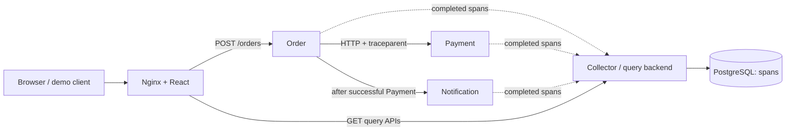

# Architecture

Exactly six runtime containers. Nginx and the compiled React app share the frontend
container; Nginx is infrastructure routing, not another business service.



Only frontend publishes a production port. Ingestion, direct backend access,
Payment, Notification and PostgreSQL stay inside Compose.

## Request and trace flow

```text
Order SERVER
├── validate-order INTERNAL
├── Order Payment CLIENT
│   └── Payment SERVER
│       └── process-payment INTERNAL
└── Order Notification CLIENT
    └── Notification SERVER
        └── send-notification INTERNAL
```

Middleware parses the W3C Trace Context version-00 subset or safely starts a new
trace for missing/malformed/unsupported context. Secure IDs are nonzero lowercase
hex. Each span gets a new span ID; trace ID continues across services. Outbound
instrumentation injects the CLIENT context into traceparent, so Payment
SERVER.parent_span_id equals Order Payment CLIENT.span_id. Notification follows
the same rule. Flags are preserved without implementing sampling.

ContextVar tokens restore the previous span on completion, exception and task
cancellation. Services reuse lifespan HTTPX clients. UTC timestamps locate spans;
monotonic clocks measure local elapsed duration.

## Telemetry and storage

Immutable finished snapshots have bounded allowlisted scalar attributes and
sanitized errors. Each service owns a bounded async queue: default capacity 256,
one worker, one-second delivery timeout, zero retries, drop-newest on saturation
and two-second shutdown drain. Business traffic does not await delivery.

The internal HTTP/JSON collector validates one span and its 64 KiB limit, then
stores it in PostgreSQL. Composite (trace_id, span_id) identity makes ingestion
idempotent: 201 stored, 200 duplicate, preserving the first committed payload.
No parent FK means children can arrive first. There is no persisted traces table.

Queries derive summaries and combine filters before pagination. List selection
and reconstruction use a consistent snapshot and batched retrieval. Iterative
parent-ID traversal sorts siblings, preserves orphan subtrees and uses a visited
set for cycles/deep chains. Arrival order does not define hierarchy.

One root's monotonic duration is the summary duration; missing/multiple roots use
the available timestamp window. Any ERROR span makes the trace ERROR. Structural
gaps/cycles mark it incomplete independently of status. React renders backend
ordering/offsets, with shared coordinate bounds for ticks, gridlines and bars.
SERVER is solid, CLIENT hollow, INTERNAL thin; errors also use text/patterns.

## Scenarios and interview checkpoints

Normal gives eight OK spans. Slow Payment delays process-payment, naturally
expanding its SERVER/caller CLIENT/root. Payment error gives five spans, four
ERROR spans, Order 502 and no Notification. Injection is request-scoped.

Explain CLIENT → SERVER parenting, ContextVar reset, monotonic duration,
best-effort export, absent parent FK, arrival-order independence and why
structural incompleteness differs from ERROR.
